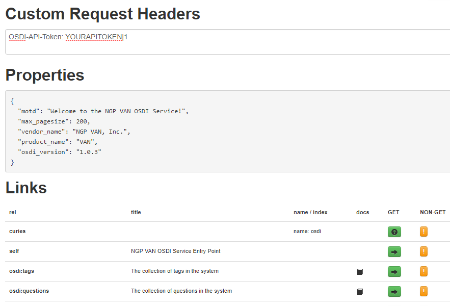

# Queer Sync
 
#### The gayest sync ever!


Queersync is an OSDU based script that will automatically pull down recent survey question answers from Spoke, and insert them into VAN / Everyaction.

You can configure a mapping between Spoke and VAN question/answers.
 
Set it up as a recurring cron job on your Spoke server to have the last N hours of activity pushed in to VAN.

## Example Output
```bash
ubuntu@wsl:~/unx/queersync$ ./queersync  
Start date 2019-06-29 08:38:20 -0400
Processing Danial Zieme
Matched to VAN https://osdi.ngpvan.com/api/v1/people/101155483
A: 851618     Q: Do you need a ride?
A: 856278     Q: Can you help us?
SUCCESS for Danial Zieme
Processing Donnell Kertzmann
Matched to VAN https://osdi.ngpvan.com/api/v1/people/101155484
A: 856279     Q: Can you help us?
SUCCESS for Donnell Kertzmann
Processing Shanelle Wintheiser
Matched to VAN https://osdi.ngpvan.com/api/v1/people/101155485
A: 856278     Q: Can you help us?
SUCCESS for Shanelle Wintheiser
Processing Elody Cronin
Matched to VAN https://osdi.ngpvan.com/api/v1/people/101155486
A: 856279     Q: Can you help us?
SUCCESS for Elody Cronin
```

# Instructions

## Prep

> Windows Users: Unless you are super kinky, BSDM and pain, I recommend using [Microsoft's Ubuntu for Windows](https://www.microsoft.com/en-us/p/ubuntu/9nblggh4msv6?activetab=pivot:overviewtab), unless you're into that, which is cool too.  _You be You._

1. Install Ruby 2.5.1

Use RVM - https://rvm.io/rvm/install
Run these shell commands:

```
gpg --keyserver hkp://pool.sks-keyservers.net --recv-keys 409B6B1796C275462A1703113804BB82D39DC0E3 7D2BAF1CF37B13E2069D6956105BD0E739499BDB

\curl -sSL https://get.rvm.io | bash -s stable

rvm install 2.5.1
```

2. Clone the github repo

3. run `bundle install`

3. `cp .example.env .env`

4. `cp config.example.json config.json`

## Edit .env

Fill in your VAN and Spoke API Tokens, or use server environment variables.

## Edit config.json

The config.json file contains the mapping between spoke answers (question_answers) and VAN survey questions.

This is contained in the "mapping" array.  To find out your question URIs on both systems use the OSDI HAL browser on each to enumerate the questions collection.  

The VAN OSDI HAL https://osdi.ngpvan.com

Your Spoke: http://your-spoke-server/osdi

In the custom headers box put `OSDI-API-TOKEN: YOURTOKEN`
Don't forget to append the dbmode `|1` on your VAN key.

Then click the 'osdi:question' link.



### Map those questions
Copy the "self" href url, and also the "key" attributes of the response objects. You'll need to use your head to match up the yucky numeric key values with the text values in VAN.

```json
     {
        "origin_system": "VAN",
        "name": "pbank",
        "description": "Will you phone bank?",
        "title": "phone bank",
        "summary": "Will you phone bank?",
        "question_type": "SingleChoice",
        "identifiers": [
          "VAN:203079"
        ],
        "_links": {
          "self": {
            "href": "https://osdi.ngpvan.com/api/v1/questions/203079" 
            // Copy me!
          }
        }, 
        "responses": [
          {
            "key": 856278, // Copy me!
            "name": "Yes",
            "title": "Yes"
          },
          {
            "key": 856279, // Copy me!
            "name": "No",
            "title": "No"
          }
        ]
      }
```
Place the URLs in the corresponding attributes.  Put the response keys in the "spoke_van_response_map" object.  The spoke key is on the left, and the VAN key is on the right:

```
 "mapping": [
    {
      "comment": "Can you help us?",
      "spoke_question_url": "http://spoke.dev.joshco.org/osdi/org/1/campaigns/1/api/v1/questions/1",
      "van_question_url": "https://osdi.ngpvan.com/api/v1/questions/203079",
      "spoke_van_response_map": {
        "Yes":  856278,
        "No": 856279
      }
    },
 
```

### Other parameters

`interval_in_seconds` The time in seconds in the past to download answers.  The prefill value is 1 day 86400 seconds.  This is good if you run it once a day.

For AEP values, the VAN one should work for everyone.  
For your spoke, you'll want the org and campaign specific one like below.

For each AEP, you can turn `trace` on if you are running into problems, which will show you the wire-level HTTP transactions.

```
{
  "interval_in_seconds": 432000,
  "spoke": {
    "aep": "http://spoke.dev.joshco.org/osdi/org/1/campaigns/1/api/v1",
    "trace": false
  },
  "van": {
    "aep": "https://osdi.ngpvan.com/api/v1",
    "trace": false
  },
```

# RUN gayly forward!

Once you've follwed the above instructions, just:

`./queersync`

You can put this in a crontab to run every night!

# License

[MIT](./LICENSE)

# Terms

`gayly` (comparative more gayly, superlative most gayly) (uncommon, dated) Cheerfully; in a gay manner.
